# Corporate Services: HR, GA, dan Training

## Gambaran Umum

Dokumentasi teknis untuk modul Human Resources, General Affair, serta Training & Development yang mencakup proses end-to-end konversi pelamar kerja menjadi karyawan aktif dengan catatan profil lengkap.

## Cakupan

**Termasuk dalam Cakupan:**
- Permintaan karyawan baru
- Persetujuan permintaan karyawan baru
- Proses rekrutment
- Database pelamar dan karyawan
- Manajemen posting lowongan kerja

## Aktor / Komponen
- **Pelamar**: Individu yang mengajukan lamaran kerja
- **Staff HR**: Personel yang mereview dan memproses lamaran
- **User**: Melakukan permintaan karyawan dan pengambil keputusan untuk persetujuan/penolakan calon pelamar
- **Direktur**: Penyetuju permintaan karyawan
- **Modul Profil Karyawan**: Komponen yang menyimpan data master karyawan

## Alur Proses Umum

## Timeline

```mermaid
gantt
    title HRGA–Training Project Timeline
    dateFormat  YYYY-MM-DD
    axisFormat  %d %b

    section Kick Off
    Kick Off Meeting           :milestone, ko, 2026-01-05, 2d
    Internal IT Alignment      :active, ko2, 2026-01-07, 3d

    section Core HR System
    Request Employee - DEV          :re_dev, 2026-01-12, 7d
    Request Employee - TEST         :re_test, 2026-01-19, 7d

    Hiring Internal - DEV           :hi_dev, 2026-01-19, 7d
    Hiring Internal - TEST          :hi_test, 2026-01-26, 7d

    Hiring Eksternal - DEV          :he_dev, 2026-01-26, 7d
    Hiring Eksternal - TEST         :he_test, 2026-02-02, 7d

    KPI - DEV                       :kpi_dev, 2026-02-02, 7d
    KPI - TEST                      :kpi_test, 2026-02-09, 7d

    Performance Aprasial - DEV      :pa_dev, 2026-02-09, 7d
    Performance Aprasial - TEST     :pa_test, 2026-02-16, 7d

    Training & Development - DEV    :td_dev, 2026-02-16, 7d
    Training & Development - TEST   :td_test, 2026-02-23, 7d

    Profiling Karyawan - DEV        :td_dev, 2026-02-23, 7d
    Profiling Karywan - TEST        :td_test, 2026-03-02, 7d

    Release                         :milestone, Vr, 2026-03-09, 1d

```

## Logika Detail

1. **Pelamar mengajukan lamaran** melalui sistem
   - Data pelamar disimpan di database pelamar
   - Status lamaran diset menjadi "Diajukan"

2. **HR menerima dan mereview lamaran**
   - Staff HR mengakses data pelamar
   - Melakukan screening awal berdasarkan persyaratan minimum

3. **Keputusan screening awal**
   - Jika persyaratan tidak terpenuhi: lanjut ke alur penolakan
   - Jika persyaratan terpenuhi: teruskan ke hiring manager

4. **Hiring manager mereview lamaran**
   - Hiring manager mengevaluasi kualifikasi pelamar
   - Membuat keputusan untuk melanjutkan atau menolak

5. **Jika ditolak di tahap manapun:**
   - Update status pelamar menjadi "Ditolak"
   - Catat alasan penolakan
   - Arsipkan data lamaran

6. **Jika disetujui oleh hiring manager:**
   - Jadwalkan interview
   - Catat detail dan hasil interview

7. **Evaluasi hasil interview**
   - Jika tidak lolos: lanjut ke alur penolakan
   - Jika lolos: siapkan surat penawaran

8. **Proses surat penawaran**
   - Generate dan kirim surat penawaran
   - Tunggu respon pelamar

9. **Keputusan penerimaan penawaran**
   - Jika ditolak: lanjut ke alur penolakan
   - Jika diterima: lanjut ke pembuatan karyawan

10. **Kumpulkan data karyawan tambahan**
    - HR mengumpulkan informasi kepegawaian lengkap
    - Validasi semua field yang diperlukan untuk profil karyawan

11. **Buat profil karyawan**
    - Transfer data yang sesuai dari data pelamar
    - Input informasi spesifik kepegawaian

12. **Generate ID karyawan**
    - Sistem auto-generate identitas karyawan unik
    - Assign ID ke profil karyawan baru

13. **Update konversi status**
    - Ubah status pelamar menjadi "Dikonversi ke Karyawan"
    - Link data pelamar ke profil karyawan
    - Set status karyawan menjadi "Aktif"

14. **Selesaikan onboarding**
    - Profil karyawan aktif di sistem
    - Data pelamar tetap disimpan untuk audit trail

## Aturan Bisnis

- Setiap pelamar harus memiliki identifikasi unik (email atau nomor identitas)
- Status pelamar harus dilacak sepanjang proses: `Diajukan`, `Dalam Review`, `Interview Terjadwal`, `Sudah Interview`, `Penawaran Terkirim`, `Penawaran Diterima`, `Ditolak`, `Karyawan`
- ID karyawan harus unik dan di-generate oleh sistem
- Data pelamar tidak dapat dihapus; harus diarsipkan dengan update status
- Profil karyawan memerlukan semua field wajib sebelum aktivasi
- Satu data pelamar hanya dapat dikonversi menjadi satu profil karyawan
- Persetujuan hiring manager wajib sebelum generate surat penawaran
- Penjadwalan interview memerlukan persetujuan hiring manager terlebih dahulu
- Penerimaan penawaran diperlukan sebelum pembuatan profil karyawan
- Tanggal mulai karyawan harus ditentukan saat pembuatan profil

## Error Handling & Edge Case

**Lamaran Duplikat:**
- Sistem harus mendeteksi pengajuan pelamar duplikat berdasarkan email/ID
- Perilaku: (tidak dispesifikasikan - lihat Pertanyaan Terbuka)

**Data Karyawan Tidak Lengkap:**
- Jika field wajib hilang saat pembuatan profil, cegah aktivasi profil
- Return validation error ke staff HR

**Pelamar Mengundurkan Diri:**
- Pelamar dapat mengundurkan diri di tahap manapun sebelum penerimaan penawaran
- Update status sesuai dan arsipkan

**Surat Penawaran Kadaluarsa:**
- Penanganan surat penawaran kadaluarsa tanpa respon (tidak dispesifikasikan - lihat Pertanyaan Terbuka)

**Multiple Posisi:**
- Apakah pelamar dapat melamar untuk beberapa posisi secara bersamaan (tidak dispesifikasikan - lihat Pertanyaan Terbuka)

## Asumsi & Pertanyaan Terbuka

**Asumsi:**
- Generate ID karyawan mengikuti skema penomoran organisasi yang ada
- Sistem memiliki kontrol autentikasi dan otorisasi untuk staff HR dan hiring manager
- Mekanisme penyimpanan dan pengambilan dokumen sudah ada
- Sistem notifikasi ada untuk update status

**Pertanyaan Terbuka:**
- Apa format/pola spesifik untuk generate ID karyawan?
- Berapa lama data pelamar disimpan di sistem?
- Apakah ada batas waktu untuk respon surat penawaran?
- Apakah orang yang sama dapat melamar kembali setelah ditolak? Jika ya, setelah berapa lama?
- Field apa yang wajib vs opsional di profil karyawan?
- Apakah ada alur kerja berbeda untuk jenis atau level posisi yang berbeda?
- Bagaimana penanganan putaran interview (tunggal vs multiple)?
- Tingkat persetujuan apa yang ada selain hiring manager?
- Apakah ada integrasi dengan sistem background check eksternal?
- Apa yang terjadi pada profil karyawan parsial jika onboarding terganggu?

## Non-Goal

- Spesifikasi UI/UX detail
- Spesifikasi integrasi dengan sistem payroll atau time tracking
- Requirement pelaporan dan analytics
- Manajemen template dokumen
- Konten dan template notifikasi email
- Definisi permission dan role user
- Spesifikasi audit log
- Requirement optimasi performa