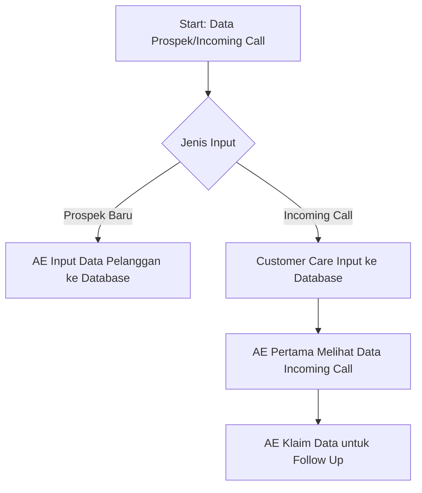

# Overview

Sistem manajemen multiple Account Executive (AE) di zona bebas (Free Trade) untuk divisi Marketing. Sistem mengatur alokasi prospek, penawaran, follow-up, dan incoming call dengan mekanisme otomatis berbasis waktu dan status.

## Scope

**Termasuk:**
- Monitoring aktivitas AE oleh Sales Manager (SM) dan Field Coordinator (FC)
- Pengiriman penawaran dan WO Digital otomatis via email
- Manajemen status prospek berdasarkan tindak lanjut AE
- Alokasi ulang prospek jika AE tidak melakukan tindak lanjut sesuai ketentuan
- Pengelolaan incoming call dari Customer Care

**Tidak termasuk:**
- Implementasi dashboard monitoring
- Format template penawaran dan WO Digital
- Mekanisme otorisasi oleh SM/FC
- Integrasi dengan sistem Customer Care

## Aktor / Komponen

- **Account Executive (AE)**: Melakukan input data prospek, follow-up, dan negosiasi
- **Sales Manager (SM)**: Mengotorisasi penawaran, monitoring, memberikan akses ke AE lain
- **Field Coordinator (FC)**: Mengotorisasi penawaran, monitoring, memberikan akses ke AE lain
- **Sistem Database**: Menyimpan data prospek, mengirim email otomatis, mengelola status
- **Customer Care**: Menerima incoming call dan input ke sistem
- **PIC Calon Pelanggan**: Menerima penawaran via email

## Data & Input

**Input Data Prospek:**
- Informasi pelanggan (wajib termasuk alamat email)
- Data contact pelanggan
- Sales activity
- Checklist tindak lanjut (Calling/Presentasi/Survey/Penawaran)
- Progress follow-up (follow-up 1 dan 2)

**Input Incoming Call:**
- Data incoming call dari Customer Care

**Output Sistem:**
- Email penawaran (format seragam untuk semua cabang)
- Email WO Digital
- WhatsApp (opsional untuk Residensial, email tetap wajib)

## Process Flow (Mermaid)

## Detailed Logic

### A. Proses Penawaran

1. **Input Data Prospek**
   - AE input data informasi pelanggan ke database
   - Input harus realtime, tidak boleh setelah dealing
   - Alamat email PIC wajib dilampirkan (untuk Residensial yang ingin via WA, email tetap wajib)
   - Status prospek = In Progress

2. **Input Sales Activity**
   - AE wajib input sales activity sebelum penawaran dapat dikirim
   - Penawaran baru dapat dikirim setelah ada sales activity di database

3. **Pembuatan dan Otorisasi Penawaran**
   - AE buat penawaran dalam sistem
   - SM/FC otorisasi penawaran
   - Sistem kirim email ke PIC dalam 10 menit setelah otorisasi

4. **Batas Waktu Penerimaan Penawaran**
   - PIC harus menerima penawaran maksimum 5x24 jam dari input data prospek
   - Jika > 5x24 jam tidak diterima → status = Open, dapat diambil AE lain

5. **Checklist Tindak Lanjut (1x24 jam pertama)**
   - AE wajib input checklist tindak lanjut dalam 1x24 jam dari input data prospek
   - Pilihan: Calling/Presentasi/Survey/Penawaran
   - Jika tidak ada checklist dalam 1x24 jam → status = Open, dapat diambil AE lain

6. **Follow Up 1**
   - Wajib dilakukan 3x24 jam setelah penawaran diterima PIC
   - Hasil follow-up wajib diinput dalam database
   - Jika tidak diinput → dianggap tidak melakukan follow-up

7. **Follow Up 2**
   - Wajib dilakukan 3x24 jam setelah follow-up 1
   - Dilakukan jika pada follow-up 1 belum terjadi dealing
   - Hasil follow-up wajib diinput dalam database

8. **Eskalasi ke AE Lain**
   - Jika sampai follow-up 2 tidak ada input data/progress → SM/FC dapat memberikan akses ke AE lain
   - Sebelum eskalasi: AE pertama diberi waktu 1x24 jam untuk klarifikasi dan input progress offline
   - Jika ada input valid (divalidasi SM/FC) → AE pertama lanjutkan
   - Jika > 1x24 jam tidak ada input → SM/FC beri akses ke AE lain di zona bebas

9. **Masa Berlaku Penawaran**
   - Expired date = 30 hari dari tanggal penawaran diterbitkan
   - Jika belum dealing setelah 30 hari → AE wajib kirim penawaran baru (boleh sama nilai dan ketentuan)

10. **Negosiasi**
    - Selama negosiasi, prospek locked ke AE pertama
    - Syarat: AE pertama melakukan follow-up sesuai ketentuan
    - Jika negosiasi > masa berlaku penawaran → kirim penawaran baru

11. **Ketentuan AE di Luar Zona Bebas**
    - Ketentuan yang sama berlaku untuk AE di luar zona bebas
    - Jika tidak melakukan tindak lanjut sesuai ketentuan → proses dilanjutkan SM/FC
    - SM/FC melakukan: kirim penawaran, follow-up, monitoring sampai dealing (administratif)

### B. Proses Incoming Call

1. **Input Incoming Call**
   - Customer Care input incoming call ke sistem database

2. **Alokasi ke AE**
   - AE yang pertama melihat data incoming call mendapat kesempatan pertama untuk follow-up

3. **Lock Data**
   - Jika AE pertama sudah follow-up → AE lain tidak dapat akses data tersebut

4. **Proses Selanjutnya**
   - Ketentuan proses sama dengan bagian Penawaran (poin 2-15)
   - Meliputi: sales activity, pembuatan penawaran, follow-up 1 & 2, masa berlaku, dll.

## Business Rules

**BR-001**: Input data prospek harus realtime, tidak boleh setelah dealing  
**BR-002**: Alamat email PIC wajib dilampirkan, termasuk untuk pelanggan Residensial yang ingin via WA  
**BR-003**: Penawaran hanya dapat dikirim setelah ada sales activity di database  
**BR-004**: Sistem kirim email penawaran otomatis 10 menit setelah otorisasi SM/FC  
**BR-005**: PIC harus menerima penawaran maksimum 5x24 jam dari input data prospek  
**BR-006**: AE wajib input checklist tindak lanjut dalam 1x24 jam dari input data prospek  
**BR-007**: Jika tidak ada checklist dalam 1x24 jam → status = Open  
**BR-008**: Jika > 5x24 jam penawaran tidak diterima PIC → status = Open  
**BR-009**: Follow-up 1 wajib dilakukan 3x24 jam setelah penawaran diterima PIC  
**BR-010**: Follow-up 2 wajib dilakukan 3x24 jam setelah follow-up 1 (jika belum dealing)  
**BR-011**: Hasil follow-up wajib diinput dalam database, jika tidak diinput = tidak melakukan follow-up  
**BR-012**: Jika sampai follow-up 2 tidak ada input → AE pertama diberi 1x24 jam untuk klarifikasi  
**BR-013**: Jika tidak ada input dalam 1x24 jam klarifikasi → SM/FC beri akses ke AE lain  
**BR-014**: Masa berlaku penawaran = 30 hari dari tanggal terbit  
**BR-015**: Jika belum dealing setelah 30 hari → wajib kirim penawaran baru  
**BR-016**: Selama negosiasi dengan follow-up sesuai ketentuan → prospek locked ke AE pertama  
**BR-017**: AE pertama yang melihat incoming call mendapat akses pertama  
**BR-018**: Jika incoming call sudah di-follow-up AE pertama → AE lain tidak dapat akses  
**BR-019**: Format penawaran seragam untuk semua cabang  
**BR-020**: Ketentuan berlaku untuk AE di zona bebas dan di luar zona bebas  

## Error Handling & Edge Cases

**E-001**: AE input data setelah dealing  
- Sistem: reject input atau tandai sebagai invalid

**E-002**: Email PIC tidak dilampirkan  
- Sistem: blokir proses penawaran sampai email dilengkapi

**E-003**: AE tidak input checklist dalam 1x24 jam  
- Sistem: ubah status prospek menjadi Open otomatis

**E-004**: Penawaran tidak diterima PIC dalam 5x24 jam  
- Sistem: ubah status prospek menjadi Open otomatis

**E-005**: AE tidak input hasil follow-up  
- Sistem: anggap tidak melakukan follow-up, trigger eskalasi ke SM/FC

**E-006**: AE input progress offline setelah 1x24 jam klarifikasi  
- Sistem: input ditolak, prospek sudah dialokasikan ke AE lain

**E-007**: Penawaran melewati 30 hari tanpa pembaruan  
- Sistem: tandai penawaran expired, blokir proses dealing sampai penawaran baru dikirim

**E-008**: Dua AE melihat incoming call bersamaan  
- Sistem: lock data untuk AE yang pertama kali klik/akses data

**E-009**: SM/FC memberikan akses ke AE lain tanpa menunggu 1x24 jam klarifikasi  
- Proses: validasi workflow harus enforce waiting period

**E-010**: AE di luar zona bebas tidak melakukan follow-up  
- SM/FC melakukan proses administratif pengganti

## Asumsi & Pertanyaan Terbuka

**Asumsi:**
- A-001: Sistem memiliki mekanisme notifikasi ke AE untuk batas waktu follow-up
- A-002: Dashboard monitoring SM/FC real-time atau near real-time
- A-003: "Melihat data" incoming call = aksi eksplisit (klik/buka detail), bukan hanya tampil di list
- A-004: Validasi input progress offline oleh SM/FC dilakukan secara manual
- A-005: Status "Open" berarti prospek visible dan dapat diambil oleh semua AE di zona bebas

**Pertanyaan Terbuka:**
- Q-001: Apakah ada prioritas AE berdasarkan performa/senioritas saat prospek kembali Open?
- Q-002: Bagaimana mekanisme jika AE sedang cuti/tidak tersedia saat batas waktu follow-up?
- Q-003: Apakah ada batasan jumlah prospek yang dapat di-handle AE secara bersamaan?
- Q-004: Bagaimana penanganan jika email PIC bounce/tidak valid?
- Q-005: Apakah ada notifikasi ke AE lama saat prospek dialokasikan ke AE baru?
- Q-006: Bagaimana perhitungan waktu: jam kerja saja atau kalender (24/7)?
- Q-007: Apakah ada mekanisme appeal jika AE merasa unfairly kehilangan prospek?
- Q-008: Bagaimana handling jika PIC meminta penawaran dikirim ke multiple email?
- Q-009: Apakah ada log audit trail untuk semua perubahan status dan alokasi?
- Q-010: Siapa yang berhak otorisasi untuk incoming call (SM/FC atau otomatis)?

## Non-Goals

- Detail implementasi UI/UX dashboard monitoring
- Spesifikasi template email penawaran dan WO Digital
- Integrasi teknis dengan sistem Customer Care
- Mekanisme autentikasi dan autorisasi user
- KPI dan metrics reporting untuk SM/FC
- Sistem reminder/notifikasi (email, push notification, SMS)
- Mekanisme eskalasi jika SM/FC tidak merespons
- Penanganan zona non-bebas (dedicated territory)
- Kompensasi dan insentif AE
- Training material atau user guide
